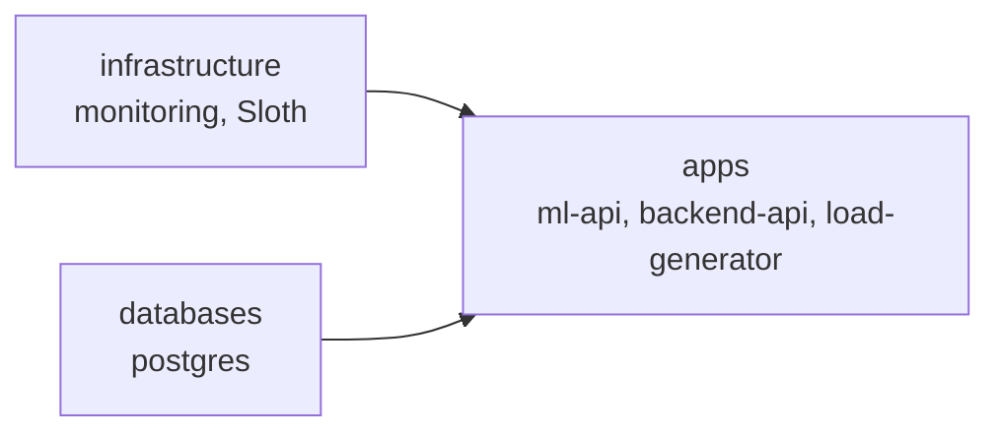
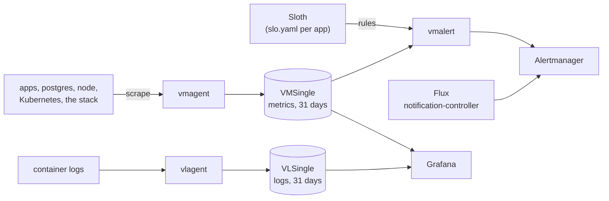

# DevOps case study: GitOps and observability on k3d

Flux deploys two Python APIs, a load generator and PostgreSQL from this
repository to a local k3d cluster. The monitoring layer adds metrics, SLOs with
burn-rate alerts, platform alerts, dashboards and logs, built from the
VictoriaMetrics stack and Sloth.

## Quick start

You need Docker, [k3d](https://k3d.io), `kubectl`, the
[Flux CLI](https://fluxcd.io/flux/installation/), a fork of this repository and
a GitHub token with `repo` scope. Tested with k3d v5.9.0, Flux v2.9.5 and
kubectl v1.36.1 on Docker Desktop.

```sh
export GITHUB_TOKEN=<token>          # or: export GITHUB_TOKEN=$(gh auth token)
./bootstrap/bootstrap.sh https://github.com/<you>/devops-case-study main
```

The script:

1. deletes a k3d cluster named `devops-cs` if one exists, then creates a new
   one (one node, Traefik disabled);
2. runs `flux bootstrap github` against your fork, path `clusters/devops-cs`;
3. waits until the `apps` Kustomization is Ready. That happens only after
   infrastructure and databases are Ready, so a finished script means
   everything runs. A full run takes about 4.5 minutes.

From then on Flux polls `main` every minute and applies what you push.
`flux reconcile source git flux-system` applies it at once.

## What runs

Flux applies one Kustomization per layer. `apps` waits for the other two:



| Namespace | What runs |
|---|---|
| `ml-api` | ML API, 2 replicas, `POST /predict` |
| `backend-api` | Backend API, 2 replicas, `POST /process`, uses postgres |
| `load-generator` | Calls both APIs every 2 seconds |
| `postgres` | PostgreSQL 16 (data in `emptyDir`) with a postgres-exporter sidecar |
| `monitoring` | `victoria-metrics-k8s-stack` chart 0.93.0 (VictoriaMetrics, vmagent, vmalert, Alertmanager, Grafana 13, VictoriaLogs, node-exporter, kube-state-metrics) and the Sloth controller |
| `flux-system` | Flux v2.9.5 |

How the signals flow:



## Use it

Nothing has an ingress. Port-forward the UI you need:

| UI | Command | Then open |
|---|---|---|
| Grafana | `kubectl -n monitoring port-forward svc/victoria-metrics-k8s-stack-grafana 3000:80` | <http://localhost:3000> |
| Alertmanager | `kubectl -n monitoring port-forward svc/vmalertmanager-victoria-metrics-k8s-stack 9093` | <http://localhost:9093> |
| vmalert (rules, alert state) | `kubectl -n monitoring port-forward svc/vmalert-victoria-metrics-k8s-stack 8080` | <http://localhost:8080> |
| vmagent (scrape targets) | `kubectl -n monitoring port-forward svc/vmagent-victoria-metrics-k8s-stack 8429` | <http://localhost:8429/targets> |
| VictoriaLogs | `kubectl -n monitoring port-forward svc/vlsingle-victoria-metrics-k8s-stack 9428` | <http://localhost:9428/select/vmui> |

Grafana's user is `admin`; get the password with
`kubectl -n monitoring get secret victoria-metrics-k8s-stack-grafana -o jsonpath='{.data.admin-password}' | base64 -d`.
Keep Grafana on port 3000: the dashboard links in alerts point there.

Grafana opens on **High level Sloth SLOs**. From there:

| Folder | Board | Answers |
|---|---|---|
| SLOs | High level Sloth SLOs | Is any SLO burning its error budget? |
| SLOs | SLO / Detail | How is one SLO doing: SLI, burn rate, budget left? |
| Apps | Apps / Requests, errors, duration | Rate, errors and latency per app; each panel links to the app's SLO, pods and logs |
| Components | Kubernetes / Compute Resources (Cluster → Namespace → Pod), Node Exporter / Nodes | Where do CPU, memory, disk and network go? |
| Components | Flux Cluster Stats, Postgres Overview, VictoriaMetrics (single-node, vmagent, vmalert, operator), VictoriaLogs (single-node, vlagent) | Is this component healthy? |

For logs, open Explore, pick `VictoriaLogs` and query, for example,
`kubernetes.pod_namespace:=backend-api "POST /process"`.

## Repository layout

Each top-level folder is one layer, and each layer is one Flux Kustomization.
Inside a layer, `base/` defines a component once and `devops-cs/` says what this
cluster runs from it, plus its differences.

```
clusters/devops-cs/        Flux wiring: one Kustomization per layer, order, health checks
  flux-system/             Flux itself (written by flux bootstrap)
infrastructure/
  base/monitoring/         monitoring stack, Sloth, Flux alerts, dashboards
  devops-cs/               this cluster's selection and patches
databases/
  base/postgres/
  devops-cs/               + the postgres Secret
apps/
  base/<app>/              Deployment, Service and SLOs (slo.yaml) per app
  devops-cs/               + backend-api's Secret
bootstrap/                 k3d config and bootstrap script
docs/                      design specs, plans, the first inspection
```

| I want to… | Go to |
|---|---|
| See how a component is defined | `<layer>/base/<component>/` |
| Change something for one cluster (version, Secret, size) | `<layer>/<cluster>/<component>/` |
| See what a cluster runs and in what order | `clusters/<cluster>/` |
| Add an infrastructure component (cert-manager, for example) | `infrastructure/base/<component>/` + `infrastructure/<cluster>/<component>/` + one line in `infrastructure/<cluster>/kustomization.yaml` |
| Add a cluster | `clusters/<cluster>/` + a `<layer>/<cluster>/` overlay per layer |
| Add a top-level layer folder | Also add `!/<folder>` to `.sourceignore`: Flux downloads only the folders listed there |
| Add or change an SLO | `apps/base/<app>/slo.yaml` (a `PrometheusServiceLevel`). Shared Sloth settings: `infrastructure/base/monitoring/sloth.yaml` |
| Change an alert rule | SLO alerts: the target in `slo.yaml`, the plugin chain in `sloth.yaml`. Platform alerts: `defaultRules` in `infrastructure/base/monitoring/helmrelease.yaml` (`rules.<AlertName>.enabled: false` switches one off; per cluster in the overlay) |
| Change where alerts go | `alertmanager.config` in `helmrelease.yaml` |
| Add or change a dashboard | A file (the apps board, Flux, Postgres): `infrastructure/base/monitoring/dashboards/`, the JSON plus one `configMapGenerator` entry. The chart's boards: `defaultDashboards` in `helmrelease.yaml`. Sloth's boards: `grafana.dashboards` (grafana.com ID and revision) |
| Use a different dashboard on one cluster | `infrastructure/<cluster>/monitoring/kustomization.yaml`: a `configMapGenerator` entry with `behavior: replace` for a file, a HelmRelease patch of `defaultDashboards` for a chart board |

## Observability

**Metrics.** vmagent scrapes Kubernetes (kubelet, cAdvisor,
kube-state-metrics), the node (node-exporter), the monitoring stack itself and
every pod annotated `prometheus.io/scrape`: both APIs on `:8000/metrics` and
postgres-exporter on `:9187`. VMSingle keeps a month (31 days).
[Metrics spec](docs/superpowers/specs/2026-09-26-victoriametrics-metrics-collection-design.md).

**SLOs.** Four SLOs, each 99% over a rolling 30 days, measured from the apps'
own metrics. The Sloth controller turns each app's `slo.yaml` into recording
and alert rules.
[SLO spec](docs/superpowers/specs/2026-09-26-slo-sli-design.md).

| Service | SLO | Bad event |
|---|---|---|
| ml-api | predict-availability | `POST /predict` answered with 5xx |
| ml-api | predict-latency | `POST /predict` slower than 1 s |
| backend-api | process-availability | `POST /process` answered with 5xx |
| backend-api | process-latency | `POST /process` slower than 0.25 s |

**Alerts.** [Alerting spec](docs/superpowers/specs/2026-09-27-alerting-design.md).

- SLO alerts: Sloth's multi-window burn-rate alerts. A fast burn pages, a slow
  burn opens a ticket, and a page silences the ticket of the same SLO.
- Platform alerts: the chart's published default rules (kube-prometheus,
  VictoriaMetrics, its operator, VictoriaLogs) plus the postgres-exporter
  mixin, pinned to the versions that run here.
- Flux failures: Flux's notification-controller sends them to Alertmanager.
- Routing: Sloth pages and `severity=critical` go to `page`, the rest to
  `ticket`. `Watchdog` fires all the time to prove the pipeline works.
- No receiver has an integration yet, so you see alerts in Alertmanager and
  Grafana only.

**Dashboards.** Three folders, top to bottom: SLOs, Apps, Components (table
above). Every board except the apps board comes unedited from a published
upstream project. [Dashboards spec](docs/superpowers/specs/2026-09-26-grafana-dashboards-design.md).

**Logs.** VLAgent reads every container's log on the node, VLSingle keeps a
month. Alerts cover the logging stack's own health, not log content.
[Logging spec](docs/superpowers/specs/2026-09-27-logging-design.md).

## Decisions and why

- **A layer per dependency level.** I wanted the apps to wait for postgres.
  Flux's `dependsOn` orders only Flux objects, and postgres shared the `apps`
  Kustomization with the apps, so postgres moved into its own `databases`
  layer. `apps` also waits for `infrastructure`, as in Flux's own example.
  Trade-off: if the monitoring install breaks, new app deploys wait until it
  works again; running apps keep running. Infrastructure skips the
  `controllers/` and `configs/` split of Flux's example: the only objects that
  need the chart's CRDs ship inside the chart (`extraObjects`), and Helm
  installs CRDs first.
- **`base/` plus a cluster overlay in every layer.** Every cluster runs the
  same definitions, and a cluster that needs something different (a chart
  version, a Secret, a volume size) changes only that, in one place. With one
  cluster this buys little today; I expect more.
- **Credentials live in the cluster overlay,** because they differ per
  cluster. They are plain text for now (test values). Before any real secret,
  such as a notification webhook, encrypt Secrets with SOPS and age; Flux
  decrypts those itself.
- **One vendor for metrics, alerts and logs.** The VictoriaMetrics chart
  brings all three with one operator. Loki would add a second chart and its
  own agent (Grafana Alloy).
- **Published rules and dashboards over hand-written ones,** pinned to the
  versions that run here. The one exception is the apps board: request rate,
  errors and latency per app come first when something breaks, and no
  published board fits the apps' metric names.
- **SLOs from the apps' own metrics.** An earlier version measured ml-api with
  a blackbox probe; I removed the blackbox exporter. The kubelet already
  probes `/health` and `/ready`, and the default pod alerts fire on those.
- **Sloth controller over the Sloth CLI.** Each app ships its SLOs next to its
  manifests, and nothing is generated or committed by hand, which scales to
  many services. Sloth's defaults stay (30-day period), so its dashboards run
  unedited. Sloth's status has no conditions, so the `apps` Kustomization
  checks `promOpRulesGenerated` to catch a broken SLO. Trade-off: the
  generated rules live in the cluster, not in git.
- **99% targets:** a 30-day budget of about 7 hours of full outage. I chose it
  while ml-api's availability came from a probe every 30 s, where 99.9% would
  page on two failed probes in an hour, and kept it after the switch.
- **Downloads at deploy time, accepted.** The chart's sync job fetches alert
  rules and dashboards from GitHub at every Helm upgrade; Grafana fetches
  Sloth's two boards and the VictoriaLogs plugin from grafana.com at start.
  Without internet the upgrade fails and retries, and Grafana starts without
  those boards or the logs data source.
- **Postgres on `emptyDir`.** Its data is throwaway here.
- **No CI yet.** I push straight to `main`, and Flux reports a broken render a
  minute later. CI belongs in the setup once changes go through pull requests.

## Known issues

- **Backend 500s after a restart.** `POST /process` returns 500 with
  `relation "documents" does not exist`. Postgres keeps its data in
  `emptyDir`, so every restart empties it. backend-api creates the table only
  at startup and ignores errors, so if postgres isn't ready yet the table never
  appears. `dependsOn` can't help: it orders Flux, not pod restarts. Workaround:
  once postgres runs, `kubectl -n backend-api rollout restart deployment/backend-api`.
- **ml-api counts no errors.** Its `/predict` handler increments
  `ml_api_requests_total{status="200"}` just before it returns and has no error
  path, so the predict-availability SLO shows 100% whatever happens, and its
  burn-rate alerts can't fire. The default pod alerts (`KubePodNotReady`,
  `KubeDeploymentReplicasMismatch`, `KubePodCrashLooping`) still catch an
  ml-api outage, as a ticket after 15 minutes. The SLO needs no change once the
  app counts its real status.
- **Plain-text logs.** The apps log plain text, so Grafana shows a level only
  through the regex rules in the VictoriaLogs data source, and Python
  tracebacks arrive one line per entry. Read a traceback back with
  `… "Traceback" | stream_context after 30`. JSON logs in the apps would fix
  both: vlagent turns JSON fields into log fields, so levels need no rules and
  a traceback stays one entry.
- **Two alerts off on purpose.** `PostgresHasTooManyRollbacks`: backend's
  `/ready` runs `SELECT 1`, and the connection pool rolls that back on every
  call. `NodeClockNotSynchronising` (this cluster only): the Docker Desktop VM
  runs no NTP daemon; `NodeClockSkewDetected` still watches the offset.

## Next steps

- App changes (the images aren't in this repo): ml-api counts its real
  response status; backend-api creates its table with retries, or a migration
  Job does; both apps log JSON with a `level` field; backend commits after its
  readiness `SELECT 1`.
- A notification channel for `page` and `ticket`, after SOPS and age.
- CI (render and validate every change) once changes go through pull requests.

## More documentation

Design specs in [`docs/superpowers/specs/`](docs/superpowers/specs/) describe
each part and its acceptance criteria:

- [Step 0: environment inspection](docs/superpowers/specs/2026-09-25-step-0-environment-inspection-design.md)
  and its [findings](docs/inspection/step-0-findings.md)
- [Metrics collection](docs/superpowers/specs/2026-09-26-victoriametrics-metrics-collection-design.md)
- [SLOs and SLIs](docs/superpowers/specs/2026-09-26-slo-sli-design.md)
- [Grafana dashboards](docs/superpowers/specs/2026-09-26-grafana-dashboards-design.md), including the dashboard review
- [Alerting](docs/superpowers/specs/2026-09-27-alerting-design.md)
- [Logging](docs/superpowers/specs/2026-09-27-logging-design.md)

The implementation plans in [`docs/superpowers/plans/`](docs/superpowers/plans/)
record how the earlier steps were built; later changes updated the specs, not
the plans.
