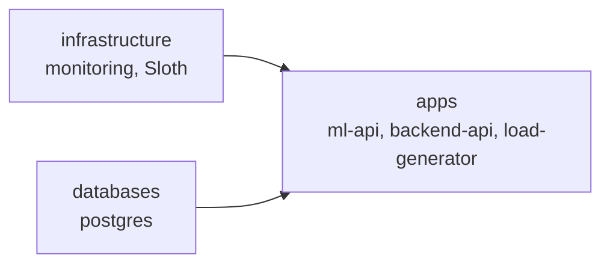
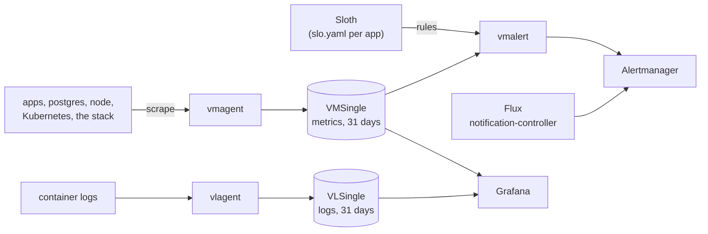

# DevOps case study: GitOps and observability on k3d

Flux deploys two Python APIs, a load generator and PostgreSQL from this
repository to a local k3d cluster. I added metrics, SLOs with burn-rate alerts,
platform alerts, dashboards and logs, built from the VictoriaMetrics stack and
Sloth. Flux deploys all of it from this repository.

The case study asks three questions, answered in these sections:

- [What I monitor and why](#what-i-monitor-and-why), with the
  [dashboard design](#dashboards)
- [Alerts and what they catch](#alerts-and-what-they-catch)
- [Trade-offs](#decisions-and-trade-offs) and
  [what I'd do with more time](#with-more-time)

## Quick start

You need Docker, [k3d](https://k3d.io), `kubectl`, the
[Flux CLI](https://fluxcd.io/flux/installation/), a fork of this repository and
a GitHub token with `repo` scope. Tested with k3d v5.9.0, Flux v2.9.5 and
kubectl v1.36.1 on Docker Desktop.

```sh
export GITHUB_TOKEN=<token>          # or: export GITHUB_TOKEN=$(gh auth token)
./bootstrap/bootstrap.sh https://github.com/<you>/devops-case-study main
```

The script:

1. deletes a k3d cluster named `devops-cs` if one exists, then creates a new
   one (one node, Traefik disabled);
2. runs `flux bootstrap github` against your fork, path `clusters/devops-cs`;
3. waits until the `apps` Kustomization is Ready. That happens only after
   infrastructure and databases are Ready, so a finished script means
   everything runs. A full run takes about 4.5 minutes.

Check the result with `kubectl get pods -A` and `flux get all`.

From then on Flux polls `main` every minute and applies what you push.
`flux reconcile source git flux-system` applies it at once.

## What runs

Flux applies one Kustomization per layer. `apps` waits for the other two:



| Namespace | What runs |
|---|---|
| `ml-api` | ML API, 2 replicas, `POST /predict` |
| `backend-api` | Backend API, 2 replicas, `POST /process`, uses postgres |
| `load-generator` | Calls both APIs, about 17 requests a minute each |
| `postgres` | PostgreSQL 16 (data in `emptyDir`) with a postgres-exporter sidecar |
| `monitoring` | `victoria-metrics-k8s-stack` chart 0.93.0 (VictoriaMetrics, vmagent, vmalert, Alertmanager, Grafana 13, VictoriaLogs, node-exporter, kube-state-metrics) and the Sloth controller |
| `flux-system` | Flux v2.9.5 |

How the signals flow:



## Use it

Nothing has an ingress. Port-forward the UI you need:

| UI | Command | Then open |
|---|---|---|
| Grafana | `kubectl -n monitoring port-forward svc/victoria-metrics-k8s-stack-grafana 3000:80` | <http://localhost:3000> |
| Alertmanager | `kubectl -n monitoring port-forward svc/vmalertmanager-victoria-metrics-k8s-stack 9093` | <http://localhost:9093> |
| vmalert (rules, alert state) | `kubectl -n monitoring port-forward svc/vmalert-victoria-metrics-k8s-stack 8080` | <http://localhost:8080> |
| vmagent (scrape targets) | `kubectl -n monitoring port-forward svc/vmagent-victoria-metrics-k8s-stack 8429` | <http://localhost:8429/targets> |
| VictoriaLogs | `kubectl -n monitoring port-forward svc/vlsingle-victoria-metrics-k8s-stack 9428` | <http://localhost:9428/select/vmui> |

Grafana's user is `admin`; get the password with
`kubectl -n monitoring get secret victoria-metrics-k8s-stack-grafana -o jsonpath='{.data.admin-password}' | base64 -d`.
Keep Grafana on port 3000: the dashboard links in alerts point there.

For logs, open Explore, pick `VictoriaLogs` and query, for example,
`kubernetes.pod_namespace:=backend-api "POST /process"`.

## What I monitor and why

I watch what a caller of the APIs feels first, then what causes it, then the
platform underneath.

1. **Rate, errors and latency of the user endpoints,** `POST /predict` and
   `POST /process`. Probe and metrics endpoints stay out. Errors and latency
   become SLOs, so an alert means the error budget is going, and a single slow
   request stays quiet.
2. **Ready pods.** The apps count only the requests they receive. A pod that
   fails its readiness probe leaves its Service and gets none, so a full
   outage shows up as silence in the apps' metrics, with no errors.
3. **Causes:** ml-api's memory against its limit, backend-api's connection
   pool and query results, and postgres through postgres-exporter.
4. **The platform:** the node, Kubernetes objects, Flux and the monitoring
   stack itself, through published rules and boards.

The key metrics the apps expose, and where I use each:

| Metric | Panel on the apps board | Alert |
|---|---|---|
| `ml_api_requests_total` | Rate, Errors | predict-availability SLO |
| `ml_api_request_duration_seconds` | Duration | predict-latency SLO |
| `ml_api_predictions_total` | none: it equals the `/predict` requests with status 200 | none |
| `ml_api_memory_bytes` | Memory, next to the container's working set and limit | none: the memory alerts use the working set, which the kernel compares with the limit |
| `backend_api_requests_total` | Rate, Errors | process-availability SLO |
| `backend_api_request_duration_seconds` | Duration | process-latency SLO |
| `backend_api_db_connections_active` | DB connections | `BackendDbPoolNearlyFull` |
| `backend_api_db_queries_total` | DB queries | `BackendDbQueryErrors` |

**Collection.** vmagent scrapes Kubernetes (kubelet, cAdvisor,
kube-state-metrics), the node (node-exporter), the monitoring stack itself and
every pod annotated `prometheus.io/scrape`: both APIs on `:8000/metrics` and
postgres-exporter on `:9187`. One annotation rule covers every pod, so a new
app needs no monitoring change to be scraped. VMSingle keeps 31 days.
[Metrics spec](docs/superpowers/specs/2026-09-26-victoriametrics-metrics-collection-design.md).

**SLOs.** Four SLOs, each 99% over a rolling 30 days, from the apps' own
metrics. Each app keeps its SLOs in its own `slo.yaml`, and the Sloth
controller turns them into recording and alert rules.
[SLO spec](docs/superpowers/specs/2026-09-26-slo-sli-design.md).

| Service | SLO | Bad event |
|---|---|---|
| ml-api | predict-availability | `POST /predict` answered with 5xx |
| ml-api | predict-latency | `POST /predict` slower than 1 s |
| backend-api | process-availability | `POST /process` answered with 5xx |
| backend-api | process-latency | `POST /process` slower than 0.25 s |

### Dashboards

Grafana opens on **High level Sloth SLOs**. Three folders, top to bottom, take
you from "is something wrong" to "which component":

| Folder | Board | Answers |
|---|---|---|
| SLOs | High level Sloth SLOs | Is any SLO burning its error budget? |
| SLOs | SLO / Detail | How is one SLO doing: SLI, burn rate, budget left? |
| Apps | Apps / Service health | Per app: rate, errors, latency, then ready pods, memory (ml-api) and the database pool (backend-api). Each panel links to the app's SLO, pods and logs |
| Components | Kubernetes / Compute Resources (Cluster → Namespace → Pod), Node Exporter / Nodes | Where do CPU, memory, disk and network go? |
| Components | Flux Cluster Stats, Postgres Overview, VictoriaMetrics (single-node, vmagent, vmalert, operator), VictoriaLogs (single-node, vlagent) | Is this component healthy? |

I wrote the apps board; every other board comes unedited from a published
upstream project, pinned to the version that runs here. Alerts link to the
board that explains them.
[Dashboards spec](docs/superpowers/specs/2026-09-26-grafana-dashboards-design.md).

### Logs

VLAgent reads every container's log on the node, and VLSingle keeps 31 days.
Alerts cover the logging stack's own health, not log content.
[Logging spec](docs/superpowers/specs/2026-09-27-logging-design.md).

## Alerts and what they catch

Every alert has a severity. Alertmanager sends Sloth's fast burns and
`severity=critical` to the receiver `page`, and everything else to `ticket`.
No receiver has an integration yet, so you see alerts in Alertmanager and
Grafana only. `Watchdog` fires all the time to prove the pipeline works.
[Alerting spec](docs/superpowers/specs/2026-09-27-alerting-design.md).

| Source | Catches |
|---|---|
| Sloth, from each `slo.yaml` | An SLO burning its error budget. A fast burn (14.4 times the sustainable rate over 5 minutes and 1 hour) pages; a slow burn opens a ticket. A page silences the ticket of the same SLO. |
| My rules in `infrastructure/base/monitoring/workload-alerts.yaml` | `DeploymentUnavailable` (page): an app has had no ready pod for 1 minute. `ContainerOOMKilled` (ticket): a container restarted after reaching its memory limit. `ContainerMemoryNearLimit` (ticket): above 90% of the limit for 5 minutes. |
| My rules in `apps/base/backend-api/alerts.yaml` | `BackendDbPoolNearlyFull` (ticket): a pod has held 8 of its 10 connections for 1 minute. `BackendDbQueryErrors` (ticket): queries failed or found no free connection. |
| Published rules (the chart's default rules, pinned) | Node, Kubernetes objects (crash loops, pods not ready, missing replicas), postgres-exporter, the monitoring and logging stack. |
| Flux's notification-controller | A failed reconciliation of a Flux object (ticket). |

I added my own rules because the SLOs can't see a full outage. They count
requests inside the apps; when every pod fails readiness, no request arrives
and the error ratio has nothing to count. The published pod alerts do fire,
but as tickets after 15 minutes. `DeploymentUnavailable` pages for every
workload outside `kube-system`, `flux-system` and `monitoring`, so a new app
is covered without a rule change. The tickets name the cause.

The app images have switches that produce incidents. I ran the first three
on the cluster (the ml-api ones in a scratch namespace); the times count from
the change:

| Incident | Alerts, in order |
|---|---|
| backend-api leaks DB connections (`CONN_RETURN_MODE=hold`) | 2.5 min: `BackendDbQueryErrors` (`pool_exhausted`). 3 min: `BackendDbPoolNearlyFull`. 4 min: `DeploymentUnavailable` page. No SLO alert: 6 requests got a 503, then none reached the app. |
| ml-api leaks memory (`MEM_ALLOC_MB`; tested with 20 MB every 2 s and a 128Mi limit) | 80 s: `ContainerOOMKilled`. 3.7 min: `DeploymentUnavailable` page, once the restart backoff keeps the pod down for a minute. A slow leak raises `ContainerMemoryNearLimit` before the kill. |
| ml-api fails its liveness probe (`HEALTH_TTL_SECONDS=30`) | The kubelet restarts both pods about once a minute. 7 min: `KubePodCrashLooping` pending (a ticket 15 minutes later). 8 min: `DeploymentUnavailable` page, once the backoff keeps both pods down for a minute. |

`DeploymentUnavailable` stays firing for 5 minutes after the pods recover
(`keep_firing_for`), so a crash loop pages once instead of flapping.

These follow from the rule definitions; I didn't run them:

| Incident | Alerts |
|---|---|
| ml-api or backend-api gets slow (`RESPONSE_OVERHEAD_MS`, `QUERY_OVERHEAD_MS`) | Latency SLO page once 14.4% of the last hour's requests were slow: about 9 minutes when every request is slow. |
| backend-api answers 500 with its pods Ready (missing `documents` table) | `BackendDbQueryErrors` (`error`) within about a minute, then the availability SLO page, about 9 minutes after every request started failing. |
| postgres down | `PostgreSQLDown` after 1 minute. backend-api's `/ready` fails, so `DeploymentUnavailable` pages for backend-api. |
| Traffic stops (load generator gone, a broken Service) | Nothing: no errors, and the pods stay Ready. See [with more time](#with-more-time). |

## Decisions and trade-offs

- **A layer per dependency level.** I wanted the apps to wait for postgres.
  Flux's `dependsOn` orders only Flux objects, and postgres shared the `apps`
  Kustomization with the apps, so postgres moved into its own `databases`
  layer. `apps` also waits for `infrastructure`, as in Flux's own example.
  Trade-off: if the monitoring install breaks, new app deploys wait until it
  works again; running apps keep running. Infrastructure skips the
  `controllers/` and `configs/` split of Flux's example: the only objects that
  need the chart's CRDs ship inside the chart (`extraObjects`), and Helm
  installs CRDs first.
- **`base/` plus a cluster overlay in every layer.** Every cluster runs the
  same definitions, and a cluster that needs something different (a chart
  version, a Secret, a volume size) changes only that, in one place. With one
  cluster this buys little today; I expect more.
- **Credentials live in the cluster overlay,** because they differ per
  cluster. They are plain text for now (test values). Before any real secret,
  such as a notification webhook, encrypt Secrets with SOPS and age; Flux
  decrypts those itself.
- **VictoriaMetrics in place of Prometheus.** Nothing else in the setup
  depends on that choice: VictoriaMetrics answers PromQL, vmagent reads the
  same `prometheus.io` annotations, its operator turns `PrometheusRule`
  objects (what Sloth writes) into its own rules, and Grafana reads it as a
  Prometheus data source. The same chart and operator also bring alerting and
  logs (VictoriaLogs). Loki would add a second chart and its own agent
  (Grafana Alloy).
- **Published rules and dashboards over hand-written ones,** pinned to the
  versions that run here. I made two exceptions, the apps board and five alert
  rules: no published set knows these apps' metrics, and the published pod
  alerts only open tickets after 15 minutes.
- **SLOs from the apps' own metrics.** An earlier version measured ml-api with
  a blackbox probe; I removed the blackbox exporter. The kubelet already
  probes `/health` and `/ready`, and `DeploymentUnavailable` covers the
  outage an in-app SLI misses.
- **Sloth controller over the Sloth CLI.** Each app ships its SLOs next to its
  manifests, and nobody generates or commits rules by hand, which scales to
  many services. Sloth's defaults stay (30-day period), so its dashboards run
  unedited. Sloth's status has no conditions, so the `apps` Kustomization
  checks `promOpRulesGenerated` to catch a broken SLO. Trade-off: the
  generated rules live in the cluster, not in git.
- **99% targets.** Each endpoint gets about 17 requests a minute, about 1,000
  an hour. A page needs 14.4 times the sustainable error rate over the last
  hour: at 99.9% that is about 15 failed requests in an hour, at 99% about
  150. The 99% budget allows about 250 failed requests a day.
- **Downloads at deploy time, accepted.** The chart's sync job fetches alert
  rules and dashboards from GitHub at every Helm upgrade; Grafana fetches
  Sloth's two boards and the VictoriaLogs plugin from grafana.com at start.
  Without internet the upgrade fails and retries, and Grafana starts without
  those boards or the logs data source.
- **Postgres on `emptyDir`.** Its data is throwaway here.
- **No CI yet.** I push straight to `main`, and Flux reports a broken render a
  minute later. CI belongs in the setup once changes go through pull requests.

## Known issues

- **Backend 500s after a restart.** `POST /process` returns 500 with
  `relation "documents" does not exist`. Postgres keeps its data in
  `emptyDir`, so every restart empties it. backend-api creates the table only
  at startup and ignores errors, so if postgres isn't ready yet the table never
  appears. `dependsOn` can't help: it orders Flux, not pod restarts. Workaround:
  once postgres runs, `kubectl -n backend-api rollout restart deployment/backend-api`.
- **ml-api counts no errors.** Its `/predict` handler increments
  `ml_api_requests_total{status="200"}` just before it returns and has no error
  path, so the predict-availability SLO shows 100% whatever happens, and its
  burn-rate alerts can't fire. `DeploymentUnavailable` still pages when ml-api
  has no ready pod. The SLO needs no change once the app counts its real
  status.
- **Plain-text logs.** The apps log plain text, so Grafana shows a level only
  through the regex rules in the VictoriaLogs data source, and Python
  tracebacks arrive one line per entry. Read a traceback back with
  `… "Traceback" | stream_context after 30`. JSON logs in the apps would fix
  both: vlagent turns JSON fields into log fields, so levels need no rules and
  a traceback stays one entry.
- **Two alerts off on purpose.** `PostgresHasTooManyRollbacks`: backend's
  `/ready` runs `SELECT 1`, and the connection pool rolls that back on every
  call. `NodeClockNotSynchronising` (this cluster only): the Docker Desktop VM
  runs no NTP daemon; `NodeClockSkewDetected` still watches the offset.

## With more time

- **Measure availability where the caller sees it,** through an ingress or
  metrics in the load generator. An outage or a broken Service would then
  burn error budget instead of pausing it, and `DeploymentUnavailable` would
  become a backup. Until then, an alert on a request rate of 0 would catch
  traffic that stops.
- **App changes** (the images aren't in this repo): ml-api counts its real
  response status; backend-api creates its table with retries, or a migration
  Job does; both apps log JSON with a `level` field; backend commits after its
  readiness `SELECT 1`.
- **A notification channel** for `page` and `ticket`, after SOPS and age, and
  a dead man's switch on `Watchdog`.
- **CI** once changes go through pull requests: render every layer, validate
  the manifests, and unit-test the alert rules with `vmalert-tool`.
- **High availability:** VMSingle, Alertmanager and Grafana run one replica
  each, and postgres keeps no data across restarts.

## Repository layout

Each top-level folder is one layer, and each layer is one Flux Kustomization.
Inside a layer, `base/` defines a component once and `devops-cs/` says what this
cluster runs from it, plus its differences.

```
clusters/devops-cs/        Flux wiring: one Kustomization per layer, order, health checks
  flux-system/             Flux itself (written by flux bootstrap)
infrastructure/
  base/monitoring/         monitoring stack, Sloth, alert rules, Flux alerts, dashboards
  devops-cs/               this cluster's selection and patches
databases/
  base/postgres/
  devops-cs/               + the postgres Secret
apps/
  base/<app>/              Deployment, Service, SLOs (slo.yaml), app alerts
  devops-cs/               + backend-api's Secret
bootstrap/                 k3d config and bootstrap script
docs/                      agent working notes (specs, plans), the first inspection
```

| I want to… | Go to |
|---|---|
| See how a component is defined | `<layer>/base/<component>/` |
| Change something for one cluster (version, Secret, size) | `<layer>/<cluster>/<component>/` |
| See what a cluster runs and in what order | `clusters/<cluster>/` |
| Add an infrastructure component (cert-manager, for example) | `infrastructure/base/<component>/` + `infrastructure/<cluster>/<component>/` + one line in `infrastructure/<cluster>/kustomization.yaml` |
| Add a cluster | `clusters/<cluster>/` + a `<layer>/<cluster>/` overlay per layer |
| Add a top-level layer folder | Also add `!/<folder>` to `.sourceignore`: Flux downloads only the folders listed there |
| Add or change an SLO | `apps/base/<app>/slo.yaml` (a `PrometheusServiceLevel`). Shared Sloth settings: `infrastructure/base/monitoring/sloth.yaml` |
| Change an alert rule | SLO alerts: the target in `slo.yaml`, the plugin chain in `sloth.yaml`. My rules: `workload-alerts.yaml` in `infrastructure/base/monitoring/`, app-specific ones in `apps/base/<app>/alerts.yaml`. Published rules: `defaultRules` in `infrastructure/base/monitoring/helmrelease.yaml` (`rules.<AlertName>.enabled: false` switches one off; per cluster in the overlay) |
| Change where alerts go | `alertmanager.config` in `helmrelease.yaml` |
| Add or change a dashboard | A file (the apps board, Flux, Postgres): `infrastructure/base/monitoring/dashboards/`, the JSON plus one `configMapGenerator` entry. The chart's boards: `defaultDashboards` in `helmrelease.yaml`. Sloth's boards: `grafana.dashboards` (grafana.com ID and revision) |
| Use a different dashboard on one cluster | `infrastructure/<cluster>/monitoring/kustomization.yaml`: a `configMapGenerator` entry with `behavior: replace` for a file, a HelmRelease patch of `defaultDashboards` for a chart board |

## Working notes

This README is the documentation; you need nothing else to run or understand
the setup.

I built this with AI coding agents. [`docs/superpowers/`](docs/superpowers/)
is my scratch pad from that work, kept to show how I got to each decision.
The folder name comes from Superpowers, the agent skill set that wrote it. In
a team repository I'd delete the folder once the work is done and keep the
decisions in this README.

- **Specs** ([`specs/`](docs/superpowers/specs/)): the design I agreed with
  the agent before each step, with its acceptance checks. I updated them with
  every later change, so they match the cluster and hold more detail than this
  README:
  - [Step 0: environment inspection](docs/superpowers/specs/2026-09-25-step-0-environment-inspection-design.md)
    and its [findings](docs/inspection/step-0-findings.md)
  - [Metrics collection](docs/superpowers/specs/2026-09-26-victoriametrics-metrics-collection-design.md)
  - [SLOs and SLIs](docs/superpowers/specs/2026-09-26-slo-sli-design.md)
  - [Grafana dashboards](docs/superpowers/specs/2026-09-26-grafana-dashboards-design.md), including the dashboard review
  - [Alerting](docs/superpowers/specs/2026-09-27-alerting-design.md)
  - [Logging](docs/superpowers/specs/2026-09-27-logging-design.md)
- **Plans** ([`plans/`](docs/superpowers/plans/)): the agent's task lists for
  the first four steps. I didn't update them after later changes, so read
  them as history.
