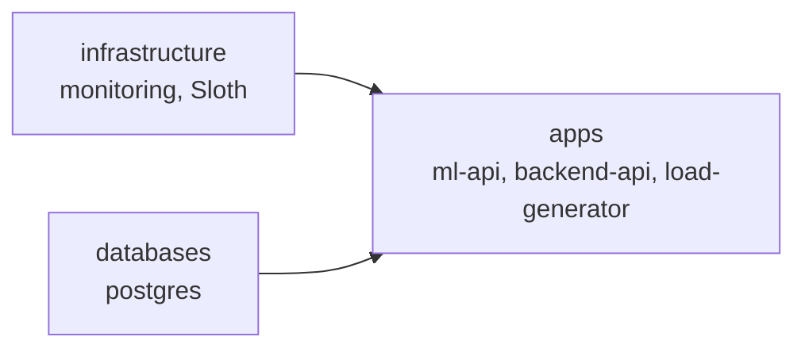
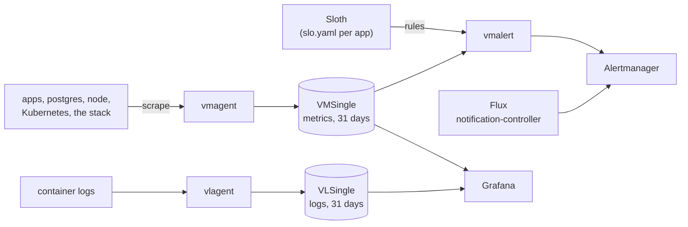

# DevOps case study: GitOps and observability on k3d

This repository runs two Python APIs, a load generator and PostgreSQL on a
local k3d cluster, deployed by Flux. On top I added metrics, SLOs with
burn-rate alerts, platform alerts, dashboards and logs, built from the
VictoriaMetrics stack and Sloth and deployed the same way.

The case study asks three questions, answered in these sections:

- [What I monitor and why](#what-i-monitor-and-why), including
  [SLOs with Sloth](#why-slos-with-sloth), [dashboards](#dashboards) and
  [logs](#logs)
- [Alerts and what they catch](#alerts-and-what-they-catch)
- [Trade-offs](#decisions-and-trade-offs) and
  [what I'd do with more time](#with-more-time)

## Quick start

You need Docker, [k3d](https://k3d.io), `kubectl`, the
[Flux CLI](https://fluxcd.io/flux/installation/), a fork of this repository and
a GitHub token with `repo` scope. Tested with k3d v5.9.0, Flux v2.9.5 and
kubectl v1.36.1 on Docker Desktop.

```sh
export GITHUB_TOKEN=<token>          # or: export GITHUB_TOKEN=$(gh auth token)
./bootstrap/bootstrap.sh https://github.com/<you>/devops-case-study main
```

The script:

1. deletes a k3d cluster named `devops-cs` if one exists, then creates a new
   one (one node, Traefik disabled);
2. runs `flux bootstrap github` against your fork, path `clusters/devops-cs`;
3. waits until the `apps` Kustomization is Ready. That happens only after
   infrastructure and databases are Ready, so a finished script means
   everything runs. A full run takes about 4.5 minutes.

Check the result with `kubectl get pods -A` and `flux get all`.

From then on Flux polls `main` every minute and applies what you push.
`flux reconcile source git flux-system` applies it at once.

## What runs

Flux applies one Kustomization per layer. `apps` waits for the other two:



| Namespace | What runs |
|---|---|
| `ml-api` | ML API, 2 replicas, `POST /predict` |
| `backend-api` | Backend API, 2 replicas, `POST /process`, uses postgres |
| `load-generator` | Calls both APIs, about 17 requests a minute each |
| `postgres` | PostgreSQL 16 (data in `emptyDir`) with a postgres-exporter sidecar |
| `monitoring` | `victoria-metrics-k8s-stack` chart 0.93.0 (VictoriaMetrics, vmagent, vmalert, Alertmanager, Grafana 13, VictoriaLogs, node-exporter, kube-state-metrics) and the Sloth controller |
| `flux-system` | Flux v2.9.5 |

How the signals flow:



## Use it

Nothing has an ingress. Port-forward the UI you need:

| UI | Command | Then open |
|---|---|---|
| Grafana | `kubectl -n monitoring port-forward svc/victoria-metrics-k8s-stack-grafana 3000:80` | <http://localhost:3000> |
| Alertmanager | `kubectl -n monitoring port-forward svc/vmalertmanager-victoria-metrics-k8s-stack 9093` | <http://localhost:9093> |
| vmalert (rules, alert state) | `kubectl -n monitoring port-forward svc/vmalert-victoria-metrics-k8s-stack 8080` | <http://localhost:8080> |
| vmagent (scrape targets) | `kubectl -n monitoring port-forward svc/vmagent-victoria-metrics-k8s-stack 8429` | <http://localhost:8429/targets> |
| VictoriaLogs | `kubectl -n monitoring port-forward svc/vlsingle-victoria-metrics-k8s-stack 9428` | <http://localhost:9428/select/vmui> |

Grafana's user is `admin`; get the password with
`kubectl -n monitoring get secret victoria-metrics-k8s-stack-grafana -o jsonpath='{.data.admin-password}' | base64 -d`.
Keep Grafana on port 3000: the dashboard links in alerts point there.

For logs, open Explore, pick `VictoriaLogs` and query, for example,
`kubernetes.pod_namespace:=backend-api "POST /process"`.

## What I monitor and why

I watch what a caller of the APIs feels first, then what causes it, then the
platform underneath.

1. **Rate, errors and latency of the user endpoints,** `POST /predict` and
   `POST /process`. Probe and metrics endpoints stay out. Errors and latency
   become SLOs, so an alert means the error budget is going, and a single slow
   request stays quiet.
2. **Ready pods.** The apps count only the requests they receive. A pod that
   fails its readiness probe leaves its Service and gets none, so a full
   outage shows up as silence in the apps' metrics, with no errors.
3. **Causes:** ml-api's memory against its limit, backend-api's connection
   pool and query results, and postgres through postgres-exporter.
4. **The platform:** the node, Kubernetes objects, Flux and the monitoring
   stack itself, through published rules and boards.

The key metrics the apps expose, and where I use each:

| Metric | Panel on the app's board | Alert |
|---|---|---|
| `ml_api_requests_total` | Rate, Errors | predict-availability SLO |
| `ml_api_request_duration_seconds` | Duration | predict-latency SLO |
| `ml_api_predictions_total` | none: it equals the `/predict` requests with status 200 | none |
| `ml_api_memory_bytes` | Memory, next to the container's working set and limit | none: the memory alerts use the working set, which the kernel compares with the limit |
| `backend_api_requests_total` | Rate, Errors | process-availability SLO |
| `backend_api_request_duration_seconds` | Duration | process-latency SLO |
| `backend_api_db_connections_active` | DB connections | `BackendDbPoolNearlyFull` |
| `backend_api_db_queries_total` | DB queries | `BackendDbQueryErrors` |

**Collection.** vmagent scrapes Kubernetes (kubelet, cAdvisor,
kube-state-metrics), the node (node-exporter), the monitoring stack itself and
every pod annotated `prometheus.io/scrape`: both APIs on `:8000/metrics` and
postgres-exporter on `:9187`. One annotation rule covers every pod, so a new
app needs no monitoring change to be scraped. VMSingle keeps 31 days.

### Why SLOs with Sloth

I built the monitoring around SLOs so that it scales with the number of
services. A team describes what "working" means for its service in one file,
`slo.yaml`, next to its manifests. The Sloth controller does the rest, and
every service gets the same things without anyone writing alert rules or SLO
boards:

- recording rules for each SLI over every window from 5 minutes to 30 days;
- multi-window burn-rate alerts: a page when the service burns its error
  budget fast, a ticket when it burns slowly. Alertmanager routes them by
  Sloth's `sloth_severity` label, so a new service needs no routing change;
- a row on High level Sloth SLOs and its own view on SLO / Detail. Both
  boards read Sloth's labels, so a new SLO appears without a dashboard change;
- two safety nets. An `slo.yaml` that Sloth can't turn into rules fails the
  `apps` Kustomization, and Flux opens a ticket. An `slo.yaml` that is valid
  but records nothing, for example a misspelled metric name, raises
  `SLOHasNoData`.

Teams and management get the same high-level view of every service: is it
meeting its target, and how much error budget is left over the last 30 days.
Reading it takes no knowledge of the service's metrics.

To add a service:

1. Expose a request counter with a status label and a latency histogram on
   `/metrics`, as both apps here do.
2. Annotate its pods with `prometheus.io/scrape`, `prometheus.io/port` and
   `prometheus.io/path`; vmagent scrapes every annotated pod.
3. Copy `apps/base/ml-api/slo.yaml` into the app's folder, change the queries
   and the target, and list the file in the app's `kustomization.yaml`.
4. Optionally, copy `apps/base/ml-api/dashboard.json` and its
   `configMapGenerator` entry the same way, for a board with the app's own
   metrics. Grafana picks it up from the app's namespace.

The team still writes two queries per SLO, because every app names its
metrics its own way, and picks the target, which is a product decision. The
SLOs count requests inside the app, so an app with no ready pod burns no
budget; `DeploymentUnavailable` covers that for every workload, also without a
change.

This cluster runs four SLOs, each 99% over a rolling 30 days:

| Service | SLO | Bad event |
|---|---|---|
| ml-api | predict-availability | `POST /predict` answered with 5xx |
| ml-api | predict-latency | `POST /predict` slower than 1 s |
| backend-api | process-availability | `POST /process` answered with 5xx |
| backend-api | process-latency | `POST /process` slower than 0.25 s |

### Dashboards

Grafana opens on **High level Sloth SLOs**. Three folders, top to bottom, take
you from "is something wrong" to "which component":

| Folder | Board | Answers |
|---|---|---|
| SLOs | High level Sloth SLOs | Is any SLO burning its error budget? |
| SLOs | SLO / Detail | How is one SLO doing: SLI, burn rate, budget left? |
| Apps | ml-api / Service health, backend-api / Service health | Per app: rate, errors, latency, then ready pods and memory (ml-api) or the database pool (backend-api), and the app's logs at the bottom. Each panel links to the app's SLO, pods and logs; an `Apps` menu switches between app boards |
| Components | Kubernetes / Compute Resources (Cluster → Namespace → Pod), Node Exporter / Nodes | Where do CPU, memory, disk and network go? |
| Components | Flux Cluster Stats, Postgres Overview, VictoriaMetrics (single-node, vmagent, vmalert, operator), VictoriaLogs (single-node, vlagent) | Is this component healthy? |

I wrote the two app boards. Each lives next to its app in
`apps/base/<app>/dashboard.json`, like its `slo.yaml` and alerts, so a team
owns its board the way it owns its SLOs, and a new service adds a board
without touching the monitoring stack. Grafana's sidecar loads labelled board
ConfigMaps from every namespace and names each file after its namespace and
ConfigMap, so every app can keep the file name `dashboard.json`. Every other
board comes unedited from a published upstream project, pinned to the version
that runs here. Postgres' board ships next to postgres, the rest with the
monitoring stack ([why](#where-monitoring-lives)). Alerts link to the board
that explains them.

#### Change an app board

Git is the only place a board change lasts. Grafana refuses to save over a
board it loaded from a file, and it keeps no database volume here, so anything
saved only in the UI disappears at its next restart.

1. Open the board, click **Make editable** and make your change.
2. Choose **Save → Save as copy**. The copy is an ordinary board you can save
   as often as you like.
3. On the copy, open **Export → Export as code**, expand **Advanced options**,
   pick the **Classic** model and copy the JSON. Grafana 13 exports its newer
   v2 format by default; the files here use the classic model, like the
   upstream boards.
4. Paste the JSON over `apps/base/<app>/dashboard.json`. Put back the file's
   `uid`, `title` and `tags` (the `apps` tag fills the `Apps` menu), set
   `"id": null` and `"editable": false`, and read `git diff` to see what
   changed. Delete the copy in Grafana.
5. Commit and push. Flux updates the ConfigMap, and the sidecar reloads the
   board without a Grafana restart.

A small change, such as a threshold or a query, is quicker to make in the JSON
directly. `kubectl kustomize apps/devops-cs` renders the ConfigMaps, so you can
check the file before you push.

#### Dashboards in a real setup

With many services I'd keep the principle that a board ships with the code it
describes, and add three things:

1. **One shared board for the standard view.** Once every service exposes the
   same HTTP metrics (OpenTelemetry's HTTP server metrics, for example), one
   board with a `service` variable shows rate, errors, latency and pods for any
   service, as the Sloth boards already do for any SLO. Most services then
   need no board of their own.
2. **Boards as code in the service's repository** for what the shared board
   can't show, such as business metrics or a database pool. Teams write them
   with Grafana's
   [Foundation SDK](https://grafana.com/docs/grafana/latest/as-code/observability-as-code/foundation-sdk/)
   (typed builders in Go, TypeScript, Python and more) on top of a small
   library the platform team owns: the standard rows, units, and links to the
   SLO and the logs. CI builds the JSON, and the service's deployment ships
   it, as a labelled ConfigMap like here or as a `GrafanaDashboard` object for
   the Grafana Operator. A board then changes in the same pull request as the
   metric it shows, and it comes and goes with the service.
3. **Read-only boards in production.** People try panels out in the UI and
   commit the result, as above.
   [Git Sync](https://grafana.com/docs/grafana/latest/as-code/observability-as-code/git-sync/),
   generally available since April 2026, can turn a save in the UI into a pull
   request instead of a direct commit. It syncs one repository path per
   connection, though, and Grafana advises against a connection per team or
   service, so it suits a central dashboards repository better than boards
   spread across service folders.

### Logs

vlagent runs on every node, reads every container's log and ships it to
VLSingle, which keeps 31 days. Read logs in Grafana (Explore, data source
`VictoriaLogs`), at the bottom of each app board, or in VictoriaLogs' own UI.
The app boards hide successful health, readiness and metrics requests, about
three quarters of the apps' lines. Alerts cover the logging stack's own
health, not log content.

#### Why VictoriaLogs, not Loki

- **One stack.** VictoriaLogs comes with the chart and operator that already
  run metrics and alerting, so logs took two switches, `vlsingle` and
  `vlagent`, plus the Grafana data source. Loki needs its own chart, storage
  configured by hand (its bundled MinIO is deprecated) and an agent. Promtail
  has reached end of life, so the agent is Grafana Alloy, with its own
  pipeline config.
- **Loki wouldn't save the level rules below.** Loki 3.6 reads a `level`
  field from JSON and logfmt lines. In plain text it searches for fixed words
  and checks `info` first. It misses the apps' `ERROR:` lines, postgres'
  `ERROR:` and VictoriaMetrics' tab-separated `warn` and `error`, and it tags
  any line that contains "info" (a URL, `sloth_slo_info`) as info. Fixing that
  takes regex rules in Alloy: the same rules in another place.
- **What I give up:** Grafana's Logs Drilldown app, which works only with
  Loki, and a built-in data source. Grafana downloads the VictoriaLogs plugin
  at start.

#### Log levels for plain-text logs

vlagent turns the fields of a JSON log line into log fields, so a JSON line
with a `level` field gets its level for free; Flux's controllers log that way.
Most containers here log plain text, and neither vlagent nor VictoriaLogs finds
a level in plain text. Without help, Grafana shows those lines as level
"unknown", and its level filter can't separate errors from the rest.

So the Grafana data source has five regex rules, one per level (critical,
error, warning, info, debug), matched against the message. The first match
wins, and a real `level` field beats all of them. Together they cover the
formats running here:

| Format | Example | Written by |
|---|---|---|
| Python/uvicorn prefix | `INFO:     Started server process [1]` | ml-api, backend-api |
| logfmt | `level=info msg="Installing plugin"` | Grafana |
| Tab-separated | `2026-09-28T08:57:01.259Z\tinfo\t…` | VictoriaMetrics components |
| postgres | `… UTC [318] ERROR:  duplicate key value …` | postgres |
| Bracketed | `[WARNING] No files matching import glob pattern …` | CoreDNS |
| klog | `I0928 08:56:08.798366       1 server.go:223] …` | kube-state-metrics |
| Coloured logrus | `\x1b[36mINFO\x1b[0m[0003] Plugins loaded` | Sloth |

Lines without a level word stay unknown: the load generator's output and the
lines of a Python traceback. VictoriaLogs also stores a traceback one line per
entry; read it back whole with `… "Traceback" | stream_context after 30`. The
rules live in `jsonData.logLevelRules` of the `VictoriaLogs` data source in
`infrastructure/base/monitoring/helmrelease.yaml`.

#### JSON logs as a platform rule

I'd rather the apps logged JSON, and on a platform I run it would be a hard
rule for every service: one JSON object per line with at least a timestamp,
`level` and `message`, plus fields such as a request or trace ID. JSON is the
more standard format. vlagent turns each field into a log field you can query
(`level:=error`), a traceback stays one entry, and nobody maintains level
regexes or a log shipper config. The app images aren't in this repository, so
the rules stay until the apps change. Third-party components get JSON output
switched on where they offer it, and the level rules cover the rest.

## Alerts and what they catch

Every alert has a severity. Alertmanager sends Sloth's fast burns and
`severity=critical` to the receiver `page`, and everything else to `ticket`
(`infrastructure/base/monitoring/alertmanager-config.yaml`). No receiver has
an integration yet, so you see alerts only in Alertmanager and Grafana.

A healthy cluster still shows a few alerts. `Watchdog` fires all the time to
prove the pipeline works. Two info alerts fire too, and Alertmanager silences
them through `InfoInhibitor`: `RecordingRulesNoData` for `count:up0`, because
kube-prometheus' count of down targets records nothing while every target is
up, and at times `CPUThrottlingHigh` for the Sloth controller, whose chart sets
a 50m CPU limit.

| Source | Catches |
|---|---|
| Sloth, from each `slo.yaml` | An SLO burning its error budget. A fast burn (14.4 times the sustainable rate over 5 minutes and 1 hour) pages; a slow burn opens a ticket. A page silences the ticket of the same SLO. |
| My rules in `extraRules` in `infrastructure/base/monitoring/alerts.yaml` | `DeploymentUnavailable` (page): an app has had no ready pod for 1 minute. `ContainerOOMKilled` (ticket): a container restarted after reaching its memory limit. `ContainerMemoryNearLimit` (ticket): above 90% of the limit for 5 minutes. `SLOHasNoData` (ticket): an SLO has recorded no error ratio for 15 minutes, because its queries match nothing or no request reached the service; until it records again, its burn-rate alerts can't fire. |
| My rules in `apps/base/backend-api/alerts.yaml` | `BackendDbPoolNearlyFull` (ticket): a pod has held 8 of its 10 connections for 1 minute. `BackendDbQueryErrors` (ticket): queries failed or found no free connection. |
| Published rules, pinned: kube-prometheus, VictoriaMetrics' and VictoriaLogs' own rules, the postgres-exporter mixin | Node, Kubernetes objects (crash loops, pods not ready, missing replicas), postgres-exporter, the monitoring and logging stack. |
| Flux's notification-controller, `infrastructure/base/flux-monitoring/alerts.yaml` | A Flux object that fails to apply or to become healthy (ticket), for example: a manifest the cluster rejects (the VictoriaMetrics operator's admission check refuses an invalid rule), an `slo.yaml` Sloth can't turn into rules, or a Deployment that never becomes ready. |

I added my own rules because the SLOs can't see a full outage. They count
requests inside the apps; when every pod fails readiness, no request arrives
and the error ratio has nothing to count. The published pod alerts do fire,
but as tickets after 15 minutes. `DeploymentUnavailable` pages for every
workload outside `kube-system`, `flux-system` and `monitoring`, so a new app
is covered without a rule change. The tickets name the cause. `SLOHasNoData`
covers every SLO the same way, so it also needs no change per service.

An app gets its own `alerts.yaml` only for causes the shared rules can't know.
backend-api has one for its connection pool. ml-api has none: its causes,
memory and a failing health check, are what `ContainerMemoryNearLimit`,
`ContainerOOMKilled`, `KubePodCrashLooping` and `DeploymentUnavailable` catch
for every app, and it counts no errors a rule could read (see
[Known issues](#known-issues)).

The app images have environment switches that cause incidents. I ran each
incident below on the cluster (the ml-api switches and the broken files in a
scratch namespace). Times count from the change:

| Incident | Alerts, in order |
|---|---|
| backend-api leaks DB connections (`CONN_RETURN_MODE=hold`) | 2.5 min: `BackendDbQueryErrors` (`pool_exhausted`). 3 min: `BackendDbPoolNearlyFull`. 4 min: `DeploymentUnavailable` page. No SLO alert: 6 requests got a 503, then none reached the app. |
| ml-api leaks memory (`MEM_ALLOC_MB`; tested with 20 MB every 2 s and a 128Mi limit) | 80 s: `ContainerOOMKilled`. 3.7 min: `DeploymentUnavailable` page, once the restart backoff keeps the pod down for a minute. A slow leak raises `ContainerMemoryNearLimit` before the kill. |
| ml-api fails its liveness probe (`HEALTH_TTL_SECONDS=30`) | The kubelet restarts both pods about once a minute. 7 min: `KubePodCrashLooping` pending (a ticket 15 minutes later). 8 min: `DeploymentUnavailable` page, once the backoff keeps both pods down for a minute. |
| Traffic stops (load generator scaled to 0) | 5.5 min: the SLOs' 5-minute ratios stop, because 0/0 records nothing. About 21 min: `SLOHasNoData` for every SLO of both apps (tested with a shorter wait; the rule waits 15 minutes). |
| An `slo.yaml` Sloth can't turn into rules | Under 2 min: `FluxKustomizationHealthcheckfailed`, and the Kustomization isn't Ready. |
| An `slo.yaml` with a misspelled metric name | Sloth and Flux report success. About 20 min: `SLOHasNoData` for that SLO only (tested with a shorter wait). |
| An alert rule with an invalid expression | The admission check rejects it, nothing reaches vmalert. Under 2 min: `FluxKustomizationReconciliationfailed`. |

`DeploymentUnavailable` stays firing for 5 minutes after the pods recover
(`keep_firing_for`), so a crash loop pages once instead of flapping.

These follow from the rule definitions; I didn't run them:

| Incident | Alerts |
|---|---|
| ml-api or backend-api gets slow (`RESPONSE_OVERHEAD_MS`, `QUERY_OVERHEAD_MS`) | Latency SLO page once 14.4% of the last hour's requests were slow: about 9 minutes when every request is slow. |
| backend-api answers 500 with its pods Ready (missing `documents` table) | `BackendDbQueryErrors` (`error`) within about a minute, then the availability SLO page, about 9 minutes after every request started failing. |
| postgres down | `PostgreSQLDown` after 1 minute. backend-api's `/ready` fails, so `DeploymentUnavailable` pages for backend-api. |

## Decisions and trade-offs

- **A layer per dependency level.** I wanted the apps to wait for postgres.
  Flux's `dependsOn` orders only Flux objects, and postgres shared the `apps`
  Kustomization with the apps, so postgres needed its own Kustomization. I
  moved it out of `apps/` into its own `databases/` layer: a Kustomization
  that pointed into `apps/` would sit in a folder that says "app" while Flux
  treats it as a separate step, which confuses whoever maintains it. So the
  rule is one top-level folder, one layer, one Flux Kustomization. Another
  database later is a new folder in `databases/`, with no change in
  `clusters/`. `apps` also waits for `infrastructure`, as in Flux's own example.
  Trade-off: if the monitoring install breaks, new app deploys wait until it
  works again; running apps keep running.
- **No `controllers/` and `configs/` split in infrastructure.** Flux's example
  splits them so that objects which need a CRD apply after the chart that
  installs it. Here the only such objects ship inside the chart
  (`extraObjects`, and my rules in `extraRules`), and Helm installs CRDs first.
  A CRD-based object outside the chart would fail Flux's dry-run on a fresh
  cluster.
- **`base/` plus a cluster overlay in every layer.** Every cluster runs the
  same definitions, and a cluster that needs something different (a chart
  version, a Secret, a volume size) changes only that, in one place. With one
  cluster this buys little today; I expect more.
- **Credentials live in the cluster overlay,** because they differ per
  cluster. They are plain text for now (test values). Before any real secret,
  such as a notification webhook, encrypt Secrets with SOPS and age; Flux
  decrypts those itself.
- **VictoriaMetrics in place of Prometheus.** Nothing else in the setup
  depends on that choice: VictoriaMetrics answers PromQL, vmagent reads the
  same `prometheus.io` annotations, its operator turns `PrometheusRule`
  objects (what Sloth writes) into its own rules, and Grafana reads it as a
  Prometheus data source. The same chart and operator also bring alerting and
  logs. [Logs](#why-victorialogs-not-loki) explains why VictoriaLogs and not
  Loki.
- **Published rules and dashboards over hand-written ones,** pinned to the
  versions that run here. The Kubernetes, node and Alertmanager rules, the
  Compute Resources boards and the shape of the Alertmanager config come from
  [kube-prometheus](https://github.com/prometheus-operator/kube-prometheus),
  the Prometheus Operator project's reference setup. kube-prometheus-stack,
  the usual Prometheus Helm chart, ships the same rules. The VictoriaMetrics
  chart points at kube-prometheus by default, but at its `main` branch; I
  pinned `v0.19.0`. They run on VictoriaMetrics unchanged, because they need
  only PromQL and the metric names of the same exporters (kubelet,
  kube-state-metrics, node-exporter), not Prometheus itself. The chart's sync
  job turns each `PrometheusRule` file into a `VMRule`. k3s needed one
  adaptation: it serves the API server's metrics on the kubelet's endpoint, so
  `KubeClientErrors` reads `job="kubelet"`, and the API server availability
  rules are off. My own exceptions are the app boards and six alert rules: no
  published set knows these apps' metrics, and the published pod alerts only
  open tickets after 15 minutes.
- **SLOs from the apps' own metrics.** An earlier version measured ml-api with
  a blackbox probe; I removed the blackbox exporter. The kubelet already
  probes `/health` and `/ready`, and `DeploymentUnavailable` covers the
  outage an in-app SLI misses.
- **Sloth, run as a controller.** Sloth writes the SRE workbook's
  multi-window, multi-burn-rate alerts from queries I write, and checks them
  against VictoriaMetrics' query language. Pyrra, the closest alternative,
  builds the queries itself from metric selectors. I run Sloth as a
  controller, not as a CLI in CI: the CLI means generating and committing
  rules for every SLO change, while the controller reads each `slo.yaml` in
  the cluster, which is what makes the one-file onboarding above work.
  Sloth's defaults stay (30-day period), so its dashboards run unedited.
  Sloth's status has no conditions, so the `apps` Kustomization checks
  `promOpRulesGenerated` to catch a broken SLO. Trade-off: the generated rules
  live in the cluster, not in git.
- **99% targets.** Each endpoint gets about 17 requests a minute, about 1,000
  an hour. A page needs 14.4 times the sustainable error rate over the last
  hour: at 99.9% that is about 15 failed requests in an hour, at 99% about
  150. The 99% budget allows about 250 failed requests a day.
- **Downloads at deploy time, accepted.** The chart's sync job fetches alert
  rules and dashboards from GitHub at every Helm upgrade; Grafana fetches
  Sloth's two boards and the VictoriaLogs plugin from grafana.com at start.
  Without internet the upgrade fails and retries, and Grafana starts without
  those boards or the logs data source.
- **Postgres on `emptyDir`.** Its data is throwaway here.
- **Straight to `main`, no CI.** I made every change directly on `main`,
  without branches or pull requests, and Flux reports a broken render a minute
  after a push. I also didn't pay attention to commit messages or enforce a
  convention: most messages happen to look like Conventional Commits, but
  nothing checks them and the history mixes styles. Branches, pull requests
  and CI belong in the setup once more than one person works on it.

## Known issues

- **Backend 500s after a restart.** `POST /process` returns 500 with
  `relation "documents" does not exist`. Postgres keeps its data in
  `emptyDir`, so every restart empties it. backend-api creates the table only
  at startup and ignores errors, so if postgres isn't ready yet the table never
  appears. `dependsOn` can't help: it orders Flux, not pod restarts. Workaround:
  once postgres runs, `kubectl -n backend-api rollout restart deployment/backend-api`.
- **ml-api counts no errors.** Its `/predict` handler increments
  `ml_api_requests_total{status="200"}` just before it returns and has no error
  path, so the predict-availability SLO shows 100% whatever happens, and its
  burn-rate alerts can't fire. `DeploymentUnavailable` still pages when ml-api
  has no ready pod. The SLO needs no change once the app counts its real
  status.
- **Plain-text logs.** The apps log plain text, so levels come from regex
  rules in the Grafana data source, and a Python traceback arrives one line
  per entry. See [Logs](#logs).
- **Three alerts off on purpose.** `PostgresHasTooManyRollbacks`: backend's
  `/ready` runs `SELECT 1`, and the connection pool rolls that back on every
  call. Two on this cluster only, both from the Docker Desktop VM's clock:
  `NodeClockNotSynchronising`, because the VM runs no NTP daemon
  (`NodeClockSkewDetected` still watches the offset), and
  `GroupIterationReset`, because the VM's clock steps back by up to 0.4 ms a
  few times a minute and vmalert restarts its schedule on each step
  (`TooManyMissedIterations` still catches slow evaluations).

## With more time

- **Measure availability where the caller sees it,** through an ingress or
  metrics in the load generator. An outage or a broken Service would then
  burn error budget right away, instead of pausing it until
  `DeploymentUnavailable` or `SLOHasNoData` catches it.
- **App changes** (the images aren't in this repo): ml-api counts its real
  response status; backend-api creates its table with retries, or a migration
  Job does; both apps log JSON with a `level` field; backend commits after its
  readiness `SELECT 1`.
- **Deterministic cluster start-up.** I'd explore proper dependency
  management for bringing a cluster up, where some services wait until the
  ones they need actually work. `dependsOn` is a step in that direction but
  doesn't solve it: it orders Flux's layers, and "Ready" means a readiness
  probe passed, not that postgres has backend-api's table. It also holds only
  for the first apply; nothing waits when postgres restarts later. I'd look at
  Flux health checks on the specific objects a service needs, and at schema
  migrations as Jobs that the apps wait for. Whatever the ordering, I'd still
  hold every app to one rule: it starts without its dependencies, retries with
  backoff and reports not ready until they answer, instead of crashing or
  skipping its setup the way backend-api skips its table today.
- **One metric convention across services** (OpenTelemetry's HTTP server
  metrics, for example). A shared Sloth SLI plugin would then build the
  queries, so a team only names its endpoint and target, and one shared board
  would replace the standard rows of the app boards (see
  [Dashboards in a real setup](#dashboards-in-a-real-setup)).
- **A notification channel** for `page` and `ticket`, after SOPS and age, and
  a dead man's switch on `Watchdog`.
- **CI** once changes go through pull requests: render every layer, validate
  the manifests, and unit-test the alert rules with `vmalert-tool`.
- **High availability:** VMSingle, Alertmanager and Grafana run one replica
  each, and postgres keeps no data across restarts.

## Repository layout

Each top-level folder is one layer, and each layer is one Flux Kustomization.
Inside a layer, `base/` defines a component once and `devops-cs/` says what this
cluster runs from it, plus its differences.

```
clusters/devops-cs/        Flux wiring: one Kustomization per layer, order, health checks
  flux-system/             Flux itself (written by flux bootstrap)
infrastructure/
  base/monitoring/         monitoring stack, Sloth, alert rules (alerts.yaml) and routing
  base/flux-monitoring/    Flux's alert, its board and the metrics the board reads
  devops-cs/               this cluster's selection and patches
databases/
  base/postgres/           Deployment with the exporter sidecar, Service, board (dashboard.json)
  devops-cs/               + the postgres Secret
apps/
  base/<app>/              Deployment, Service, SLOs (slo.yaml), board (dashboard.json), own alerts if needed (alerts.yaml)
  devops-cs/               + backend-api's Secret
bootstrap/                 k3d config and bootstrap script
docs/                      agent working notes (specs, plans), the first inspection
```

| I want to… | Go to |
|---|---|
| See how a component is defined | `<layer>/base/<component>/` |
| Change something for one cluster (version, Secret, size) | `<layer>/<cluster>/<component>/` |
| See what a cluster runs and in what order | `clusters/<cluster>/` |
| See what tools generate (don't edit it: the tool overwrites it; change the source) | In git: only `clusters/<cluster>/flux-system/gotk-*.yaml`, written by `flux bootstrap`. In the cluster: Sloth's rules, `kubectl get prometheusrules,vmrules -n <app>` (source: `apps/base/<app>/slo.yaml`); the chart sync job's rules and boards, `kubectl -n monitoring get vmrules,configmaps -l app.kubernetes.io/managed-by=sync-job` (source: `defaultRules` in `alerts.yaml`, `defaultDashboards` in `helmrelease.yaml`) |
| Add an infrastructure component (cert-manager, for example) | `infrastructure/base/<component>/` + `infrastructure/<cluster>/<component>/` + one line in `infrastructure/<cluster>/kustomization.yaml` |
| Add a cluster | `clusters/<cluster>/` + a `<layer>/<cluster>/` overlay per layer |
| Add a top-level layer folder | Also add `!/<folder>` to `.sourceignore`: Flux downloads only the folders listed there |
| Add or change an SLO | `apps/base/<app>/slo.yaml` (a `PrometheusServiceLevel`). Shared Sloth settings: `infrastructure/base/monitoring/sloth.yaml` |
| Change an alert rule | SLO alerts: the target in `slo.yaml`, the plugin chain in `sloth.yaml`. Rules for every app, mine (`extraRules`) and published (`defaultRules`; `rules.<AlertName>.enabled: false` switches one off, per cluster in the overlay): `infrastructure/base/monitoring/alerts.yaml`. App-specific ones: `apps/base/<app>/alerts.yaml`. Which Flux failures alert: `infrastructure/base/flux-monitoring/alerts.yaml` |
| Change where alerts go | `infrastructure/base/monitoring/alertmanager-config.yaml`: routes, receivers, inhibitions |
| Add or change a dashboard | An app's board: `apps/base/<app>/dashboard.json` plus the `configMapGenerator` entry in that app's `kustomization.yaml` ([how](#change-an-app-board)). Postgres' board: `databases/base/postgres/dashboard.json`, the same way. Flux's board: `infrastructure/base/flux-monitoring/dashboard.json`, the same way. The chart's boards: `defaultDashboards` in `helmrelease.yaml`. Sloth's boards: `grafana.dashboards` (grafana.com ID and revision) |
| Use a different dashboard on one cluster | A `configMapGenerator` entry with the same name and `behavior: replace` in the cluster's overlay of the board's layer: `apps/<cluster>/<app>/`, `databases/<cluster>/postgres/` or `infrastructure/<cluster>/flux-monitoring/`. A HelmRelease patch of `defaultDashboards` for a chart board |

### Where monitoring lives

A board lives next to what it shows. Monitoring I wrote for one app ships with
the app in `apps/base/<app>/`: its SLOs, its board and, only if it needs them,
its own alerts. The app's team owns and changes these files, and they come and
go with the app. Postgres' board, the one postgres-exporter publishes, sits in
`databases/base/postgres/` the same way.

Alert rules need one exception. The `databases` layer doesn't wait for
`infrastructure`, so on a fresh cluster Flux would reject a `VMRule` there
before the chart has installed its type. Postgres' published alerts therefore
stay in the chart's `defaultRules` (`alerts.yaml`), next to the other
published rules. App alerts don't have this problem: `apps` waits for
`infrastructure`.

Everything shared lives with the monitoring stack in
`infrastructure/base/monitoring/`: my rules for every app, the Sloth settings,
the alert routing, the published rules, and the boards of the stack itself.

Flux's monitoring is its own component, `infrastructure/base/flux-monitoring/`:
the alert that forwards Flux's failures to Alertmanager, Flux's board, and the
kube-state-metrics settings that produce `gotk_resource_info` for that board.
The stack's HelmRelease reads those settings through an optional `valuesFrom`,
so the stack also runs without the folder. It isn't in
`clusters/<cluster>/flux-system/`: `flux bootstrap` writes that folder, it
exists once per cluster with no `base/`, and an error there would stop Flux
from applying anything, itself included. Flux's own
[monitoring example](https://github.com/fluxcd/flux2-monitoring-example) also
keeps it outside `flux-system`.

## Working notes

The manifests in this repository and this README are the canonical
description of the setup. You need nothing else to run or understand it.

I built this with AI coding agents. [`docs/superpowers/`](docs/superpowers/)
is my scratch pad from that work: the design I agreed with the agent before
each step (`specs/`) and its task lists (`plans/`). The folder name comes from
Superpowers, the agent skill set that wrote them. I kept them to show how I
got to each decision. They are not canonical: they can be out of date or
describe options I later dropped, and where they disagree with the manifests
or this README, those win. In a team repository I'd delete the folder once
the work is done.

- Specs: [Step 0](docs/superpowers/specs/2026-09-25-step-0-environment-inspection-design.md)
  and its [findings](docs/inspection/step-0-findings.md),
  [metrics collection](docs/superpowers/specs/2026-09-26-victoriametrics-metrics-collection-design.md),
  [SLOs](docs/superpowers/specs/2026-09-26-slo-sli-design.md),
  [dashboards](docs/superpowers/specs/2026-09-26-grafana-dashboards-design.md),
  [alerting](docs/superpowers/specs/2026-09-27-alerting-design.md),
  [logging](docs/superpowers/specs/2026-09-27-logging-design.md)
- Plans: [`plans/`](docs/superpowers/plans/), for the first four steps
